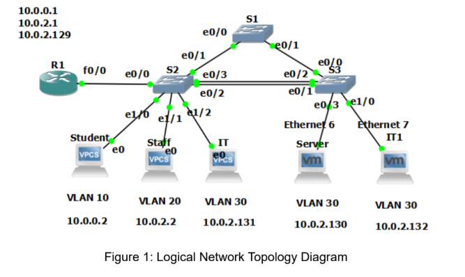
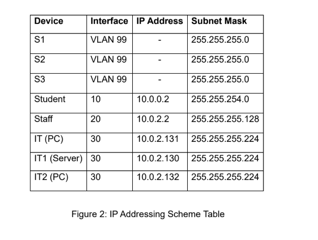

# LAN-Project
A Local Area Network Team Project

Company XYZ’s network in the project uses separate VLANs for IT, STAFF, and STUDENT departments to improve organization and security. VLSM subnetting based on 10.0.0.0/8 optimizes IP usage. The design supports inter-VLAN routing, centralized DHCP, DNS, web, TFTP services, and security features including STP, EtherChannel, port security, and VLAN hopping mitigation.

## Logical Network Topology

## IP Addressing Scheme

